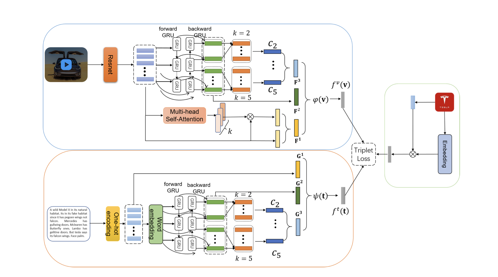

# FGMCD

Source code of **Understanding Brand’s Association: Fine-Grained Multi-Modal Content Discovery For Brands**

<p align="center">
  
  
  
</p>



**Keywords**: Brand Association, Multi-Modal Content Discovery, Fine-Grained Video Retrieval

## Requirements
<p align="center">
  
  
  
  
</p>

We used virtualenv to setup a deep learning workspace that supports PyTorch.
Run the following script to install the required packages.

### Required Data

Original data can be accessed through the specific server from HITSZ.
Contact relevant person for more information.

## Getting started

Run the following script to preprocess the original data.

Make sure the **source** path and **target** path are right.

**Remember**

- original data -> `/root/brand/ins_Car_data`
- your working directory -> `/root/$YOUR_USER_NAME$/FGMCD`
- feature data -> `/root/$YOUR_USER_NAME$/insCar`

```shell
conda activate base
pip install -r requirements.txt
python preprocess/preprocess.py
```

## Training

Run the following script to train the model.

You can access http://hpc.hitsz.edu.cn/home/instance to train and test the model.

```shell
cd bin
sh instance.sh # on instance
# OR
sh public_cluster.sh # on slurm
```

Remember
- Set right path of `ROOT_PATH` and `Python` path.  
- Set `gpu=-1` to disable GPU.
- Modify `device` in `util/constant.py` to try other GPU backends.

## Testing

Run the following script to test the model.

```shell
cd bin
sh test_instance.sh # on instance
# OR
sh test_public_cluster.sh # on slurm
# OR
# test specific epoch output
# for example, `sh test_instance.sh 2`
# will test model named `checkpoint_epoch_2.pth.tar`
sh test_instance.sh $epoch$ 
```

Remember
- Set right path of `rootpath` and `logger_name`.
- **Must** set which model would you want to test.
  - Check `insCar/model/instance` or `insCar/model/`
  - Comment `--checkpoint_name` if test the best model
- **Cannot** test when GPU type not match between train and test phase.
  - That is to say, when training on CUDA device, one can only test on CUDA device.
  - Get RunTimeError when trying to test on the device without CUDA.
- Modify `device` in `util/constant.py` to try other GPU backends.

## Dataset Structure

Store the training, validation and test subset into three folders in the following structure respectively.

```shell
${subset_name}
├── FeatureData
│   └── ${feature_name}
│       ├── feature.bin
│       ├── shape.txt
│       └── id.txt
├── ImageSets
│   └── ${subset_name}.txt
└── TextData
    └── ${subset_name}.caption.txt

```

* `FeatureData`: video frame features.
  Using [txt2bin.py](https://github.com/danieljf24/simpleknn/blob/master/txt2bin.py) to convert video frame feature in
  the required binary format.
* `${subset_name}.txt`: all video IDs in the specific subset, one video ID per line.
* `${dsubset_name}.caption.txt`: caption data. The file structure is as follows, in which the video and sent in the same
  line are relevant.
